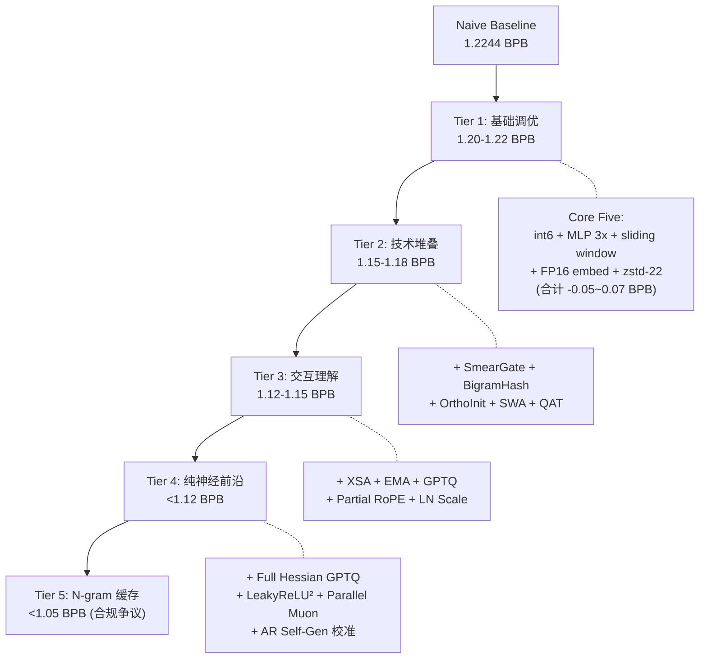

# Parameter Golf 情报汇总

## 一、竞赛格局总览

竞赛已经分裂为两条路线：

- **纯神经网络路线**（official SOTA 1.1147 BPB，pending 最好约 1.0914）
- **N-gram 缓存 + 神经网络混合路线**（pending 最好 0.4027 BPB，但合规性存疑，大量 PR 已被关闭）

官方排行榜仍停留在 **1.1147 BPB**（PR #1019, @abaybektursun, 3月25日），此后没有新的合并记录。Pending 中最强纯神经方案是 #1176（1.0914, QK-Gain + TTT + SLOT）。

## 二、已验证的关键技术及其影响

来源：Issue #83 非官方排行榜、Issue #140 AI 评论追踪器

### 2.1 基础五件套（Core Five）—— 所有竞争性方案的基石

| 技术 | BPB 影响 | 起源 |
|------|----------|------|
| Sliding Window Eval (stride=64) | **-0.034** | PR #50 @mattqlf |
| MLP 3x 扩展 (hidden=1536) | **-0.019** | PR #70 @jfprincz |
| Int6 逐行量化 | 节省 ~4MB artifact 空间 | PR #39 @nanlliu |
| FP16 Tied Embedding | **-0.007** | PR #42 @chonchiog |
| Zstd-22 压缩 (替代 zlib-9) | 节省 ~1-2MB | 共识 |

### 2.2 进阶技术栈

| 技术 | BPB 影响 | 关键发现 |
|------|----------|----------|
| SmearGate + OrthoInit | -0.003~0.005 | **必须搭配 OrthoInit**，否则反而有害 (PR #212 消融) |
| BigramHash (2048-3072) | -0.005~0.010 | 3072 桶 × 112 维是当前最优 |
| XSA (Exclusive Self-Attention) | -0.006 (全层) | 4层 vs 全层取决于是否搭配 Full GPTQ |
| EMA (decay=0.997) | -0.003 | **需要 XSA 才能生效**；没有 XSA 时 EMA 反而有害 (PR #201) |
| LeakyReLU(0.5)² | -0.003 | 一行代码改动，消除死神经元 |
| Partial RoPE (16/64 dims) | -0.001~0.002 | 让部分 head 维度做纯语义注意力 |
| LN Scale (1/sqrt(layer+1)) | -0.001 | 防止深层覆盖浅层表示 |
| Full Hessian GPTQ | -0.003~0.005 vs GPTQ-lite | 需要校准数据；AR 自生成校准是合规方案 |
| Late QAT (阈值 0.15) | -0.001~0.002 | 越晚越好；PR #315 中 QAT 实际是死代码（torch.compile 消除了分支） |
| Parallel Muon + Parameter Banking | 速度提升 ~2ms/step | 不改变模型质量，纯系统优化 |
| U-Net Skip Connections | -0.002~0.003 | 编码器-解码器跨层连接 |
| Tight SWA (every 50 steps) | -0.002 | 与 EMA 互补 |

### 2.3 评估阶段技术

| 技术 | BPB 影响 | 合规状态 |
|------|----------|----------|
| Sliding Window (stride=64) | -0.034 | 合规 |
| Legal Score-First TTT | -0.002~0.025 | 合规（但需谨慎实现） |
| N-gram Backoff Cache | -0.07~0.16 | **争议极大**，33+ PR 被关闭 |
| SLOT (输出头 TTT) | -0.001~0.006 | 存在因果性疑虑 (PR #1105) |

## 三、已证实的死胡同（极其重要）

来源：Issue #140 "What Doesn't Work" 章节、PR #375 (13 techniques)、PR #1103、PR #1227

### 3.1 彻底失败的方向

| 方向 | 结果 | 原因 |
|------|------|------|
| **MoE (Mixture of Experts)** | -0.06~0.08 BPB（严重恶化） | Apple scaling laws 证实 <500M params 时最优稀疏度=0 |
| **INT4 量化** | +0.065 BPB（灾难性） | Int6→int5 损失 0.007，但 int6→int4 损失 **0.065**（10x 恶化） |
| **知识蒸馏** | +0.003~0.407 BPB | 600s 预算下 I/O 开销致命，知识传输无法补偿 |
| **深度循环 (3+ cycles)** | 量化误差放大 ~900× | GPTQ 误差在循环中成倍放大；2 cycles 勉强存活，3+ 灾难 |
| **MLA (Multi-Head Latent Attention)** | 83ms/step (基线 43ms) | 吞吐量减半，步数不够 |
| **Larger vocabularies + fewer layers** | sp8192 8L (1.1794) > sp1024 10L (1.1508) | 嵌入矩阵 4x 大，被迫减层；深度 > 词表宽度 |
| **Multi-Token Prediction (MTP)** | 无改善 | PR #212 控制测试：1.1947 vs 1.1929 |
| **课程学习 (content-based)** | 无效果 | PR #212 |
| **SwiGLU** | 标准架构上更差 | 但 GEPA 的 AI 发现架构中用 Star-ReLU 成功 |
| **MC Dropout 集成** | +0.002~0.005 BPB | 17M 参数下子网络缺乏多样性 |
| **kNN-LM (eval time)** | +0.003 BPB | XSA 已经捕获了 kNN 试图利用的模式 |
| **2:4 结构化稀疏** | +0.672 BPB | 在竞赛规模下彻底失效 |
| **Product Quantization** | +292% BPB | 灾难性 |
| **LN Scaling (PR #1227)** | +11.4% BPB | 有害 |
| **SelfExtend 4096 eval** | +0.48 BPB | seq2048 训练的模型在 4096 上崩溃 |

### 3.2 在前沿栈上失败的方向（在弱栈上可能有效）

| 方向 | 弱栈效果 | 前沿栈效果 | 原因 |
|------|----------|----------|------|
| TTT (各种变体) | -0.014~0.025 | 中性或有害 | 过度正则化的前沿模型被局部适应扰乱 |
| Reptile Meta-TTT | -0.011 (SmearGate) | +0.008 (XSA+EMA) | 弱栈收益不迁移到前沿 |
| EMA (无 XSA) | 有害 | +0.003 (有 XSA) | EMA+XSA 是协同关系 |
| MUD 优化器 | 理论更快 | 4.5x 更慢 | 118ms/step，只跑 5087 步 |
| Turbo-Muon | 早期优势 | +0.002 BPB | 500 步优势在 7000+ 步消失 |

### 3.3 关键交互效应

> **技术交互比技术数量更重要。** 独立有效的技术组合后可能失败：
> - TTT + XSA 主动恶化 (+0.016)
> - VRL + Gated Attention + Catalytic Residuals 在 12L SWA 基上组合后更差 (1.1690 vs 1.1466)
> - SmearGate 无 OrthoInit 有害 (-0.003)
> - SWA 在 WD<0.04 下无效
> - **XSA + EMA 是大多数新技术的前置条件**

### 3.4 重要启发式规则

- **每 1ms step 开销 ≈ 0.006 BPB 损失** —— 任何增加 N ms 的技术必须带来 > N×0.006 的收益
- **1×H100 不是有效代理** —— 8x 更少的优化步，结果不可迁移
- **局部实验可能 180° 错误** —— SSM hybrid 在 dim=192 时 -18% CE，在 dim=512 时 +2.7% BPP

## 四、规则争议与执法历史

### 4.1 重大执法事件时间线

- **3月20日**：验证集数据不能出现在 artifact 中（paid prefix 被禁）
- **3月20日**：只允许 backward-looking TTT（先评分再训练）
- **3月24日**：15+ PR 被关闭 —— TTT 信息泄露 + 评估时使用训练数据做 GPTQ 校准
- **3月25日**：第二波执法 —— 评估时 GPTQ 校准被禁、N-gram 缓存"方向合法但实现非法"
- **3月27日**：**33+ N-gram cache PR 被大规模关闭** —— 哈希实现只评分正确 token 而未做全词表归一化，产生无效概率。PR #978 证明正确归一化的 n-gram 只达 1.51 BPB（比神经网络基线还差）
- **3月28日**：验证集校准 GPTQ "破坏自回归性" 被禁；自生成校准数据"可能合法"

### 4.2 当前合规要求（来源：Issue #1017 "合规提交指南"）

1. 概率分布只能依赖 artifact + 严格前缀
2. 评分前必须对全词表归一化
3. 分数必须从更新前的概率计算
4. 单次从左到右通过
5. 训练时不能访问验证集
6. GPTQ 校准必须在 600s 训练时间内完成

### 4.3 N-gram 缓存的真实现状

N-gram 缓存作为概念"方向合法"，但：
- 所有哈希实现被证明概率归一化有问题
- 正确归一化后只有 1.51 BPB（不如纯神经网络）
- **Dirichlet CTW 可能正确处理归一化** —— PR #948 (0.1156 BPB) 和 PR #1030 (0.113 BPB) 待验证
- 一个正确归一化且合规的 n-gram + 神经网络混合方案**仍是最大未解之谜**

## 五、未尝试的高价值方向

来源：Issue #140 "Untried Combinations" 章节、GitHub 悬赏列表

### 5.1 Tier 1：最高期望价值

| 方向 | 预估 BPB 改进 | 难度 | 说明 |
|------|--------------|------|------|
| **Mousse 优化器** | 0.003-0.008 | 低 | 曲率感知 Muon，Shampoo 预处理 + 正交化，12% 更有效训练 |
| **GLU Attention on Values** | 0.002-0.005 | 极低 | 对 V 投影做 GLU 非线性，零参数零开销，可与 XSA 组合 |
| **Batch Size Warmup** | 0.002-0.005 | 极低 | 从 262K 开始逐步增到 786K，43% 更少梯度步 |
| **1-sqrt Cooldown 形状** | 0.001-0.003 | 极低 | 替换线性 warmdown，免费替换 |
| **Prune-then-quantize 顺序** | 0.001-0.003 | 极低 | 当前 #609 做 quantize-then-prune；反转顺序是零成本实验 |
| **AdamHD Huber Decay** | 0.002-0.005 | 极低 | Huber 正则替换 L2 WD，抑制极端权重，改善 int6 裁剪 |
| **Brotli-11 + byte-shuffle** | 0.002-0.005 | 低 | 比 LZMA-9 多省 ~580KB，可塞更多参数 |
| **正确归一化的 N-gram 混合** | 0.01-0.10+ | 中 | 如果能解决归一化问题，这是单一最大杠杆 |

### 5.2 Tier 2：架构创新

| 方向 | 预估 BPB 改进 | 难度 | 说明 |
|------|--------------|------|------|
| **Relaxed Recursive Transformers + LoRA** | 0.01-0.03 | 中 | 共享基础权重 + per-layer LoRA，等效 24L 模型用 11L 参数 |
| **Shallow Depth Recurrence** | ~0.003 | 中 | PR #686 用 2 层浅循环达到 1.1182（3-seed），恢复 70% 独立 12L 增益 |
| **Scylla/TokenMonster tokenizer** | 0.028 | 中 | PR #1143 仅靠 tokenizer 改变从 1.1086 降到 1.0806 |
| **Hymba (Attention + Mamba SSM)** | 未知 | 高 | PR #599 达到 1.1828，首个竞争性非 transformer |
| **DCMHA (动态可组合多头注意力)** | 0.005-0.015 | 中高 | ICML 2024 Oral，匹配 1.7-2x 计算模型 |
| **DeepCrossAttention** | 0.003-0.008 | 中 | 输入依赖的深度路由，3x 收敛速度 |

### 5.3 Tier 3：前沿量化/压缩

| 方向 | 预估 BPB 改进 | 难度 | 说明 |
|------|--------------|------|------|
| **CERWU (率失真最优量化)** | 0.003-0.008 | 中 | GPTQ 是其特例 (lambda=0)，原则性升级 |
| **Entropy coding 替换 zstd** | 0.005-0.015 | 中 | ANS/Huffman 专门针对量化权重统计特性 |
| **VPTQ (Vector PTQ)** | 0.002-0.006 | 中 | 二阶 Hessian 引导向量量化，EMNLP 2024 |
| **ScaleBITS (逐层自动比特搜索)** | 0.002-0.006 | 中 | 自动决定每层用 int5 还是 int6 |
| **CPSVD (列保持 SVD)** | 0.003-0.008 | 中 | 正交于量化，减少参数数量而非精度 |

### 5.4 OpenAI 官方悬赏（未完成）

- JEPA
- Text diffusion
- H-net tokenization
- Universal transformer（有 depth recurrence 提交，但无正式 Universal Transformer）
- Megakernels
- State-space models / E2E TTT / 超长上下文
- Learning adapters on random linear maps

## 六、Encode.su 压缩论坛的观点

压缩专家社区关注的角度：

1. **评估不够严格** —— 没有真正的压缩/解压/验证流程，只是盲目信任作者脚本报告的概率
2. **N-gram 归一化问题本质上是压缩领域的老问题** —— 经典压缩器 (cmix, paq8) 必须正确归一化
3. **"外部计算"规则模糊** —— 比 Hutter Prize 更严格（连超参数调优都有限制）但又没有清晰界限
4. **建议采用类似 Hutter Prize 的标准** —— 实际生成压缩文件并验证，而非信任 BPB 报告

## 七、社区共识与争议

### 共识

- Int6 + zstd-22 几乎是最优压缩（PR #1048 测试了 8 种替代方案均不如）
- **每 step 开销是致命的** —— 600s 预算下没有容错空间
- XSA + EMA 是当前前沿的前置条件
- 更大的 tokenizer 在当前规模下不如更多层数
- 3-seed 验证是必要的（单 seed 方差 ±0.002）

### 主要争议

1. **N-gram 缓存是否算"作弊"** —— 概念合法但实现困难
2. **TTT 到底允许到什么程度** —— 组织者态度从"允许"到"不符合挑战精神"摇摆
3. **GEPA（AI 搜索架构）是否算"外部计算"** —— 用 AI 搜索超参数/架构
4. **1xH100 实验是否可靠** —— PR #1186 证明不可迁移
5. **QAT 是否真的有效** —— PR #315 中 QAT 实际是死代码，但下游抄代码的人不知道

## 八、建议的行动路线

### 路线 A：追求纯神经前沿（冲击 <1.10 BPB）

1. 以 PR #1019 (SOTA 1.1147) 代码为基础
2. 尝试低成本高收益技术：Mousse 优化器、Brotli+byte-shuffle、1-sqrt cooldown
3. 尝试 Scylla/TokenMonster tokenizer（单独可带来 -0.028）
4. 浅层 depth recurrence（2 cycles，按 PR #686 方式）
5. 解决 TTT + GPTQ 的兼容性问题

### 路线 B：解决 N-gram 归一化问题（潜在 <0.90 BPB）

1. 研究 Dirichlet CTW 正确归一化方案
2. 用 PPMII 替代启发式 backoff
3. 在 logistic 域而非线性域做神经+n-gram 混合
4. 确保严格满足四条合规标准

### 路线 C：非常规架构（Unlimited Compute 赛道）

1. Hymba (Attention + Mamba SSM) 已有 proof-of-concept
2. Text diffusion（官方悬赏）
3. JEPA（官方悬赏）
4. Megakernels（纯系统优化）
